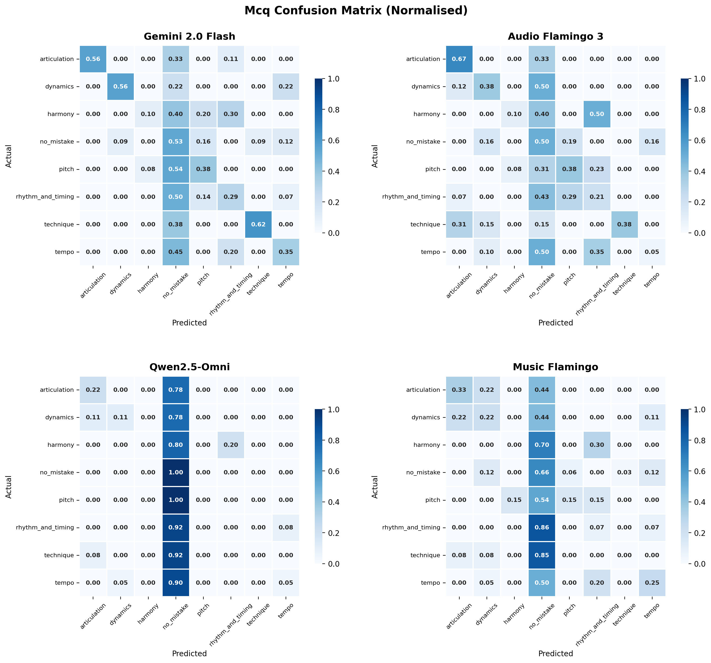
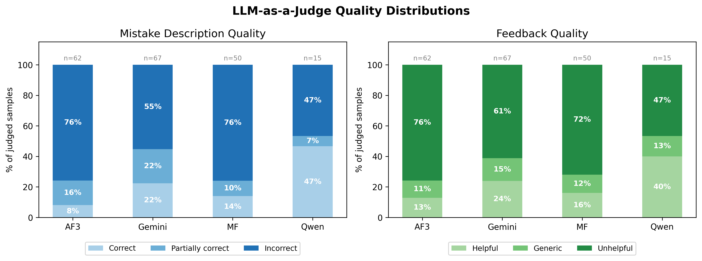

# LALM Music Benchmark

Can AI models identify mistakes in music performances and give useful feedback to students? This benchmark tests four state-of-the-art audio language models on 138 piano and guitar recordings across three task formats: multiple-choice classification, open-ended assessment, and pairwise comparison.

  [](https://doi.org/10.26219/heal.aueb.10123)

**Thesis:** Benchmarking Audio Language Models for Music Performance Assessment  
**Author:** Eleni Zanou, Athens University of Economics and Business, March 2026  
**Supervisor:** Assoc. Prof. Themos Stafylakis  
**DOI:** [10.26219/heal.aueb.10123](https://doi.org/10.26219/heal.aueb.10123)

---

## Abstract

Large audio-language models (LALMs) have been evaluated on a range of musical capabilities, including knowledge, reasoning, and information retrieval. However, the ability of LALMs to assess piano and guitar performances, including detecting, categorising, and describing mistakes, and providing useful feedback, remains unexplored. We address this gap by introducing a benchmark of 138 piano and guitar recordings, each either performed correctly or containing a single intentional mistake from one of seven categories including pitch, rhythm and timing, and harmony. We evaluate four models (Gemini 2.0 Flash, Qwen2.5-Omni-7B, Audio Flamingo 3, and Music Flamingo) on three tasks: classifying the type of mistake from a fixed set of options, describing the mistake in free text and providing corrective feedback, and comparing two performances of the same exercise against a given criterion. Free-text responses are further assessed through SBERT cosine similarity and an LLM-as-a-Judge approach with GPT-4o. Even the best-performing model, Gemini 2.0 Flash, achieves only 43.3% on multiple-choice classification, and three of four models fall below chance on pairwise comparison. The majority of mistake descriptions are rated as incorrect by the LLM judge, and no model consistently produces feedback that would be useful to a student. These results reveal a significant gap between current LALM capabilities and the requirements of music performance assessment.

---

## Dataset

138 piano and guitar recordings, each either a correct performance or containing a single intentional mistake from one of seven categories.

| Task | Samples | Description |
| ---- | ------- | ----------- |
| `mcq` | 120 | Select the correct mistake category from 4 shuffled options (A-D) |
| `open_ended` | 120 | Output a JSON with mistake category, description, and corrective feedback |
| `pairwise` | 60 | Identify which of two recordings matches a given criterion |

**Audio types:** Single-audio (student only) and double-audio (reference + student concatenated with a beep separator)

**Instruments:** Guitar and piano

**Mistake categories:** `pitch`, `harmony`, `rhythm_and_timing`, `tempo`, `articulation`, `dynamics`, `technique`, `no_mistake`

---

## Models

| Provider key | Model | Access |
| ------------ | ----- | ------ |
| `gemini` | Gemini 2.0 Flash | Google API |
| `qwen` | Qwen2.5-Omni-7B | DashScope API |
| `audio_flamingo` | NVIDIA Audio Flamingo 3 | Local GPU (RunPod) |
| `music_flamingo` | NVIDIA Music Flamingo | Local GPU (RunPod) |

---

## Results

Chance baseline: 25% for MCQ (4 options), 50% for pairwise (binary).

| Task | Metric | Gemini 2.0 Flash | Audio Flamingo 3 | Music Flamingo | Qwen2.5-Omni |
| ---- | ------ | :--------------: | :--------------: | :------------: | :----------: |
| **MCQ** | Accuracy | **43.3%** | 33.3% | 28.3% | 30.0% |
| | F1 (macro) | **0.453** | 0.326 | 0.205 | 0.129 |
| **Pairwise** | Accuracy | **68.3%** | 43.3% | 36.7% | 46.7% |
| | F1 (macro) | **0.683** | 0.481 | 0.355 | 0.443 |
| **Open-Ended** | Detection accuracy | **61.7%** | 49.2% | 42.5% | 32.5% |
| | SBERT similarity | **0.364** | 0.279 | 0.295 | 0.267 |

### MCQ Confusion Matrices



### LLM-as-a-Judge Quality (Open-Ended)

Open-ended responses are assessed by GPT-4o on two dimensions: mistake description quality and feedback quality.



### Key Findings

- **Gemini outperforms all models on every metric across all three tasks.** Despite being a general-purpose model, it outperforms both domain-specialised models on MCQ, pairwise, and open-ended assessment.
- **Three of four models fall below the 50% chance baseline on pairwise comparison.** Qwen (46.7%), Audio Flamingo 3 (43.3%), and Music Flamingo (36.7%) all fail to exceed chance. A positional bias analysis confirms their label preferences persist even after reversing the audio order.
- **Qwen and Music Flamingo default to predicting `no_mistake`.** Qwen predicts no mistake for nearly every sample regardless of category. Music Flamingo follows a similar pattern, defaulting to `no_mistake` for 86% of Rhythm and Timing and 85% of Technique samples.
- **Harmony and Rhythm and Timing are the hardest categories across all models and tasks**, with no model exceeding 10% on Harmony and 29% on Rhythm and Timing in the multiple-choice task.
- **Flamingo models produce large numbers of output format errors** consistent with a mismatch between their training format and the structured JSON required by this benchmark. AF3 produces 69 parse errors (57.5% of samples) and Music Flamingo 47 (39.2%) before recovery.
- **Only Gemini benefits from the reference audio.** Its MCQ accuracy improves from 39.6% to 45.8% with double audio, while the other three models all perform worse, with Music Flamingo dropping the most (from 35.4% to 23.6%).
- **Across all models, the majority of mistake descriptions are rated as incorrect and most feedback as unhelpful.** Gemini performs best, with 22% of descriptions rated correct and 24% of feedback rated helpful by the LLM judge.

---

## Setup

Requires Python >= 3.11, [uv](https://github.com/astral-sh/uv), and `ffmpeg` (used for audio decoding/resampling — install via `brew install ffmpeg`, `apt install ffmpeg`, or your platform's package manager).

```bash
git clone https://github.com/elzanou/bsc-thesis
cd bsc-thesis
uv sync
cp .env.example .env
# Fill in: GEMINI_API_KEY, OPENAI_API_KEY, DASHSCOPE_API_KEY
# For local models on RunPod: RUNPOD_API_KEY, RUNPOD_POD_ID
```

---

## Usage

### Preprocess

```bash
python scripts/preprocess.py --task mcq
python scripts/preprocess.py --task open_ended
python scripts/preprocess.py --task pairwise
```

### Run Inference

```bash
# API-based models
python scripts/inference.py --task mcq --provider gemini
python scripts/inference.py --task all --provider qwen

# Test with 5 samples
python scripts/inference.py --task mcq --provider gemini --index :5

# Dry run (validate pipeline without API calls)
python scripts/inference.py --task all --provider gemini --dry-run

# Local models on RunPod GPU (see RUNPOD.md)
python scripts/runpod_run.py sync --all
python scripts/runpod_run.py run --task all --provider audio_flamingo
```

### Evaluate

```bash
# MCQ or pairwise
python scripts/evaluate.py --task mcq --results-dir data/results/mcq/gemini/<run_id>

# Open-ended (detection + SBERT)
python scripts/evaluate.py --task open_ended --results-dir data/results/open_ended/gemini/<run_id>

# Open-ended with LLM-as-a-Judge
python scripts/evaluate.py --task open_ended --results-dir data/results/open_ended/gemini/<run_id> --judge

# Cross-model comparison
python scripts/compare.py
```

---

## Repository Structure

```text
music-evalkit/
├── src/music_evalkit/
│   ├── data/            # Schema, preprocessing, audio processing, data loading
│   ├── models/          # LLM provider abstraction (Gemini, Flamingo, Qwen, OpenAI)
│   ├── inference/       # Inference runner with caching and retry logic
│   ├── messages/        # OpenAI-compatible message construction with base64 audio
│   ├── prompts/         # System prompt templates per task and audio setting
│   └── evaluation/      # Metrics, parsers, SBERT similarity, LLM judge, visualisation
├── scripts/
│   ├── preprocess.py    # XLSX to inference-ready CSV + audio
│   ├── inference.py     # Send audio to ALMs, cache results
│   ├── evaluate.py      # Score results against ground truth
│   ├── compare.py       # Cross-model comparison report
│   └── runpod_run.py    # Remote GPU inference orchestration
├── data/
│   ├── Music_samples.xlsx   # Annotations (mistakes, feedback, audio references)
│   ├── processed/           # Preprocessed CSVs (audio files gitignored)
│   └── results/             # Inference and evaluation outputs per model and run
│       ├── README.md        # Maps each thesis table/figure to its run
│       └── figures/         # Thesis figures (confusion matrices, judge distributions)
├── config.yaml          # Provider configuration (API keys via env vars)
└── .env.example         # API key template
```

---

## Citation

```bibtex
@thesis{zanou2026music,
  title   = {Benchmarking Audio Language Models for Music Performance Assessment},
  author  = {Zanou, Eleni},
  year    = {2026},
  month   = {March},
  school  = {Athens University of Economics and Business},
  type    = {Bachelor's Thesis},
  doi     = {10.26219/heal.aueb.10123},
  url     = {https://doi.org/10.26219/heal.aueb.10123}
}
```

---

## License

[Creative Commons Attribution-NonCommercial 4.0 International](http://creativecommons.org/licenses/by-nc/4.0/)
